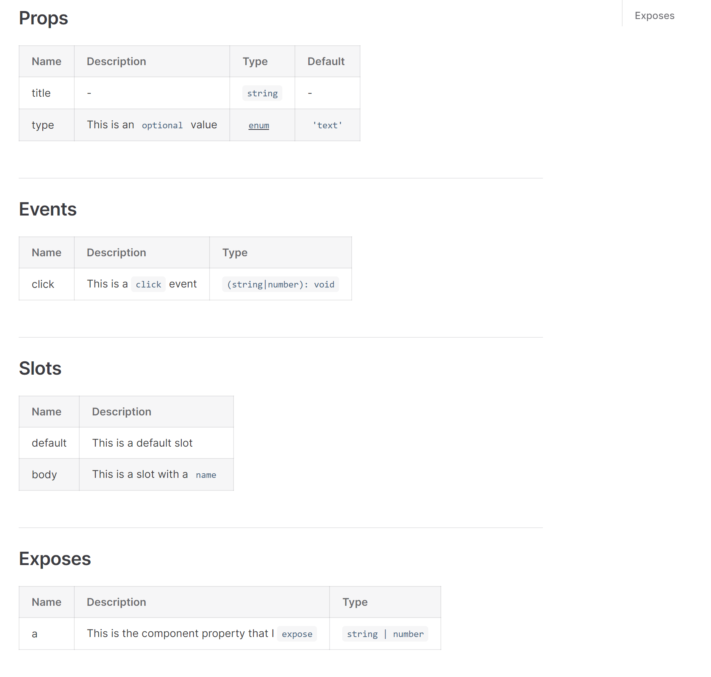

# markdown-it-vue-docgen

[](https://www.npmjs.com/package/markdown-it-vue-docgen)

A markdown-it plugin implemented with [vue-docgen-api](https://www.npmjs.com/package/vue-docgen-api) for parsing documentation comments of Vue components. It is used with the `<vue-docgen />` tag.

## Install

```bash
npm install markdown-it-vue-docgen
```

## Usage

Write your Vue component and add relevant comments:

```html
<script lang="ts" setup>
import { defineExpose, ref } from 'vue'

withDefaults(
  defineProps<{
    title: string
    /**
   * This is an `optional` value
   */
    type?: 'text' | 'number' | 'digit' | 'password' | 'textarea'
  }>(),
  {
    type: 'text',
  },
)

const emit = defineEmits<{
  /**
   * This is a `click` event
   */
  (type: 'click', event: string | number): void
}>()

const value = ref('')

defineExpose({
  /**
   * This is the component property that I `expose`
   * @type {string|number}
   */
  a: value,
})
</script>

<template>
  <!-- @slot This is a default slot -->
  <slot />

  <!-- @slot This is a slot with a `name` -->
  <slot name="body" />
</template>
```

In your markdown file, use the `<vue-docgen>` tag and provide the src:

```html
<vue-docgen src="./Button.vue" />
```

The tag will parse and generate relevant markdown information:



You can provide a title attribute which will be added to the beginning of each line, which is useful for distinguishing multiple components:

```html
<vue-docgen title="Button" src="./Button.vue" />
```

The generated markdown will be:

```markdown
## Button Props
<!-- ... -->
## Button Events
<!-- ... -->
```

## Options

You can customize the component path being used by setting the plugin's options:

```js
import { resolve } from 'node:path'
import vueDocgen from 'markdown-it-vue-docgen'

md.use(vueDocgen, {
  dir: resolve(__dirname, '../../components/')
})
```

Then refer to the custom dir path using the `~` identifier:

```html
<vue-docgen src="~/Button.vue" />
```

You can also set the container for the popup that displays the prop type. For example, you can customize the container using `vue3-popup` loaded with `vitepress` (assuming you have registered the `popup` component globally):

```js
md.use(vueDocgen, {
  popup: (text, content) => `<popup content="${content}">${text}</popup>`
})
```

## License

[MIT](./LICENSE) License © 2022 [Hairyf](https://github.com/hairyf)